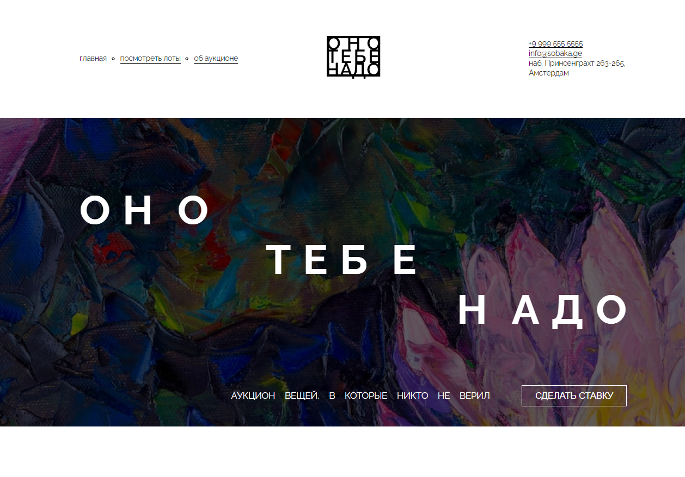

<h1>Проект: "Оно тебе надо"</h1>

<a href="https://www.figma.com/file/OrjnaV84KU7Y04Q6gFMC4x/%232-Оно-тебе-надо-(Copy)?node-id=1%3A3&mode=dev">Ссылка на макет</a> 

<h2>Описание:</h2>

Проекто создан в ходе обучения на курсе Яндекс практикум - "Фронтенд разработчик"

Применены знания полученые в изучении HTML & CSS на базовом уровне

<h3>Технологии</h3>
<ol>
<li>HTML</li>
<li>CSS</li>
<li>БЭМ</li>
<li>Flex</li>
<li>Grid</li>
</ol>
<h2>Инструкция по эксплуатации</h2>
<a href="https://opigon1.github.io/ono-tebe-nado/">Ссылка на GitPage</a>
Клонировать репозиторий:

    git@github.com:opigon1/ono-tebe-nado.git

<h2>Статус проекта: Завершён</h2>
